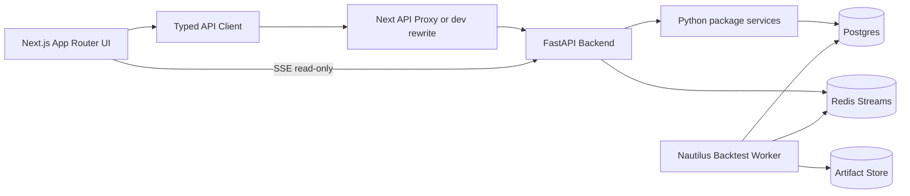

# Nautilus Builder Frontend-Ready Operator MVP Design

Date: 2026-05-23

## Summary

Nautilus Builder should become frontend-ready as an operator MVP, not merely a static component demo. The frontend must let an operator author strategies, configure market data, validate profiles, request backend-owned backtests, observe runtime progress, review results, use advisory AI, and request safe promotion while preserving the Builder-only and no-live-order boundaries.

The current repo already has a minimal Next.js shell, placeholder TSX components, HTTP-style API helpers, FastAPI route contracts, Python package seams, and contract tests. The gap is a real interactive frontend, runtime proxy wiring, typed API/state boundaries, and browser E2E coverage against a composed local stack.

## Non-goals and hard boundaries

- Do not use MCP as the browser transport. MCP remains a possible future agent wrapper, not the web frontend/backend connection.
- Do not give the frontend runtime ownership. Browser refresh, close, reconnect, or redeploy must not cancel backend jobs.
- Do not submit live orders, create `TradeAction`, call broker/exchange APIs, or directly control Nautilus-Daedalus.
- Do not store authoritative strategy/job/result state only in client memory.
- Do not let AI output bypass validation, lifecycle, or manual approval gates.

## Target architecture



Web transport is HTTP/JSON for commands and queries, plus SSE for runtime events/log observation.

Recommended deployment shape:

```text
Browser
  /                 -> Next.js
  /api/*            -> FastAPI
  /events/* or SSE  -> FastAPI streaming endpoint
```

Local development may use either Next rewrites or `NEXT_PUBLIC_API_BASE_URL`, but the design should make the backend target explicit and testable.

## App shell

The shell should provide navigation and global status:

```text
+------------------------------------------------------+
| Nautilus Builder                                     |
| Strategies | Builder | Backtests | Results | AI      |
+------------------------------------------------------+
| Backend: connected | Mode: Builder-only/no-live-order |
+------------------------------------------------------+
```

Requirements:

- Layout and navigation for all operator workflows.
- Backend health indicator.
- Global safety banner: Builder-only, no live execution authority.
- Standard loading, empty, error, and retry states.
- Accessible keyboard/navigation behavior.

## Frontend modules

### Strategies list and detail

Purpose: let operators find, create, inspect, version, and open StrategySpecs.

Required UI:

- Strategy list with name, stage, latest version, validation status, last updated.
- New strategy flow.
- Strategy detail with version history, validation reports, and entry points to Builder/spec editor/backtest.

Required API:

- `GET /api/strategies`
- `POST /api/strategies`
- `GET /api/strategies/{strategy_id}`
- `PATCH /api/strategies/{strategy_id}` or equivalent draft update route
- `POST /api/strategies/{strategy_id}/versions`

### Visual Strategy Builder

Purpose: replace the placeholder component with an interactive graph authoring surface.

Layout:

```text
+------------------+---------------------------+----------------+
| Blocks           | Canvas                    | Inspector      |
| EMA              | [EMA] -> [Cross Above]    | Selected block |
| RSI              | [RSI] -> [Exit Rule]      | Params/form    |
| Cross Above      |                           | Validation     |
+------------------+---------------------------+----------------+
| StrategySpec preview/editor + validation messages                    |
+---------------------------------------------------------------------+
```

Requirements:

- React Flow graph editor for blocks/nodes/edges.
- Block inspector for parameters.
- StrategySpec JSON/YAML preview/editor using Monaco or CodeMirror.
- Graph to StrategySpec serialization.
- StrategySpec to graph deserialization.
- Inline validation messages from backend validation.
- Save draft and create version actions.
- No runtime execution logic in the browser.

### Market/backtest profile panel

Purpose: configure approved market data before job creation.

Required UI:

- Adapter selector.
- Venue/market-type selector if exposed by adapter registry.
- Instrument search.
- Data type/timeframe selector.
- Date range picker.
- Data availability panel.
- Validate profile button and validation result display.

Required API:

- `GET /api/adapters`
- `GET /api/instruments?adapter_id=&query=`
- `GET /api/data-availability?instrument_id=&bar_type=`
- `POST /api/backtest-profiles/validate`

The current path-param instrument/data routes should be reconciled to query-friendly routes or wrapped by the frontend client with a stable typed interface.

### Backtest jobs and observational terminal

Purpose: request backend-owned jobs and observe them without owning runtime.

Required API:

- `POST /api/backtest-jobs`
- `GET /api/backtest-jobs/{job_id}`
- `POST /api/backtest-jobs/{job_id}/cancel`
- `GET /api/backtest-jobs/{job_id}/events` or SSE stream equivalent

Terminal allowed commands:

- `help`
- `status`
- `show config`
- `show validation`
- `show metrics`
- `tail logs`
- `request cancel`

Terminal forbidden commands:

- shell execution (`bash`, `zsh`, REPLs)
- network tools (`curl`, `wget`, `nc`)
- Docker/kubectl/system commands
- secret/env dumps
- live broker/exchange actions

Cancellation must set backend state. Workers must observe backend state, not frontend connection state.

### Results dashboard

Purpose: inspect backend-computed result artifacts.

Required UI:

- Summary metrics.
- Equity curve.
- Trades table.
- Fills table.
- Logs view.
- Artifact browser/download links.
- Result comparison as a later extension.

Required API:

- `GET /api/results/{result_id}`
- `GET /api/results/{result_id}/artifacts`
- `GET /api/results/{result_id}/trades`
- `GET /api/results/{result_id}/fills`

### Advisory AI copilot

Purpose: draft and revise strategies while remaining advisory-only.

Required UI:

- Prompt input.
- AI explanation panel.
- Draft StrategySpec preview.
- Validation result.
- Apply-to-builder action only after validation.
- AI thread/audit display.

Rules:

- AI output stage is draft.
- AI output must never include live execution authority.
- Applying AI output updates draft authoring state, not runtime state.
- AI audit records must persist.

### Promotion request

Purpose: request safe shadow/signal-preview promotion after validation.

Required UI:

- Promotion target limited to safe preview/shadow mode.
- Validation and artifact prerequisites shown.
- Manual approval status.
- Request promotion button.

No live order submission control should exist.

## Frontend state model

Use two explicit state categories:

1. Server state via TanStack Query or equivalent:
   - strategies
   - adapters/instruments/data availability
   - validation reports
   - jobs/events/results
   - AI drafts/threads
   - promotion requests

2. Draft UI state via reducer or Zustand:
   - unsaved graph nodes/edges
   - selected block
   - editor text
   - dirty state
   - local form state before backend validation

Backend state becomes authoritative after save, validate, submit, cancel, or promote requests.

## Testing strategy

Frontend readiness requires more than Python contract tests.

Required test layers:

1. Python API contract tests for backend payloads and hardguards.
2. TypeScript unit tests for API client, graph/spec conversion, and terminal command parser.
3. Component tests for Builder, market profile validation, AI copilot, terminal, and results dashboard.
4. Playwright E2E against a local composed stack:
   - create/edit StrategySpec
   - validate profile
   - create backtest job
   - observe SSE events
   - open result dashboard
   - AI draft to validation to save
   - safe promotion request

## Implementation milestones

### FE-01: Frontend infrastructure

- Add lockfile and install workflow.
- Add TypeScript config, lint, format, unit test runner.
- Add API base/proxy configuration.
- Add typed API client and error model.
- Add app shell, navigation, and backend health state.

### FE-02: Strategy CRUD UX

- Strategy list/detail pages.
- Draft create/edit/save flow.
- Version history display.
- Backend route coverage for update/version creation.

### FE-03: Interactive Builder

- React Flow graph.
- Block palette and inspector.
- Graph/spec roundtrip.
- Spec editor and validation panel.

### FE-04: Market/profile UX

- Adapter/instrument/data selectors.
- Data availability display.
- Profile validation route alignment.

### FE-05: Backtest jobs and events

- Job creation API/client/UI.
- Job detail/status UI.
- SSE runtime event stream.
- Observational terminal command guard.

### FE-06: Results dashboard

- Metrics, equity, trades, fills, logs, artifacts.
- Result route tied to backend result payloads.

### FE-07: AI copilot UX

- Prompt/revision panel.
- Persistent AI thread/audit view.
- Apply draft after validation.

### FE-08: Promotion UX

- Shadow/signal-preview promotion request.
- Manual approval state.
- No live execution controls.

### FE-09: Browser E2E and report

- Compose Next + FastAPI + local backing services.
- Playwright covers the operator MVP path.
- Generate and commit verification report.

## Acceptance criteria

- `npm run build` passes in `apps/web`.
- Frontend API client has typed request/response contracts.
- Browser can complete the operator MVP path through backend APIs.
- Refresh/reconnect does not lose backend job status.
- No frontend code path can submit live orders or access credentials.
- Full Python suite remains green.
- Frontend unit/component/E2E tests are part of verification.
- Documentation states MCP is not the browser transport.

## Self-review

- No placeholders such as TBD/TODO remain in this design.
- The design preserves Builder-only, no-live-order, and UX-not-runtime-owner boundaries.
- The design separates current repo reality from target frontend readiness.
- The design identifies route gaps and test gaps rather than claiming they are done.
- The design avoids MCP for browser transport and keeps MCP as future agent-facing scope only.
